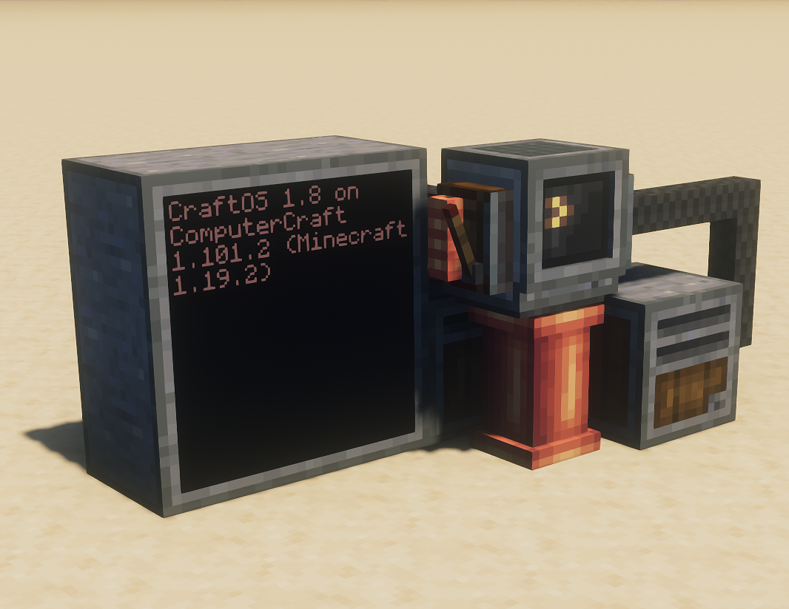

# ccc

ComputerCraft textures that fit in with Create. Want brass computers with amber
phosphor screens? Chunky 8-inch floppy disks? Turtles with silly faces? Then
this pack is for you!

This project is affiliated with neither Create nor ComputerCraft.

*Visit the [Modrinth page](https://modrinth.com/resourcepack/ccc)*

## Screenshots

 This work is licensed under a <a rel="license" href="http://creativecommons.org/licenses/by-sa/4.0/">Creative Commons Attribution-ShareAlike 4.0 International License</a>.
